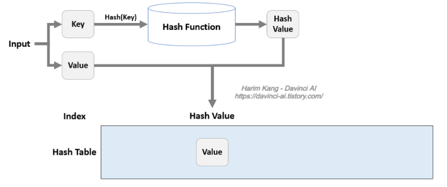
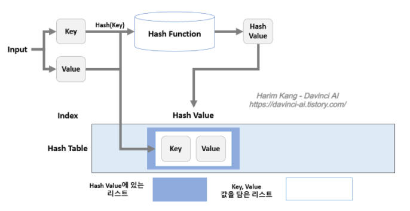
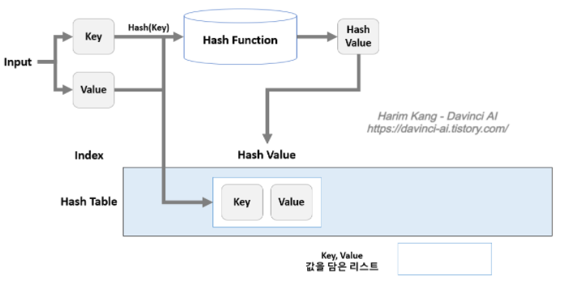

### Hash
> 해시란 데이터의 효율적 관리를 목적으로 임의의 길이의 데이터를 고정된 길이의 데이터로 매핑하는 자료구조이다.
> 
> 이 때 매핑 전 원래 데이터의 값을 키 (Key), 매핑 후 데이터의 값을 해시값 (hash value), 매핑하는 과정 자체를 해싱 (hashing) 이라고 한다.
>
> key값이 배열의 인덱스로 반환되기 때문에 **검색과 저장이 아주 빠르게** 진행 됩니다.

- **장점**
    - **데이터 저장 / 검색 속도가 빠릅니다.**
    - **해시는 키에 대한 데이터가 있는지(중복) 확인이 쉽습니다.**
- **단점**
    - **일반적으로 저장공간이 좀 더 많이 필요합니다.**
    - **여러 키에 해당하는 주소가 동일할 경우 충돌을 해결하기 위한 별도 자료구조가 필요 합니다.**
- **시간 복잡도**
    - 일반적인 경우 (충돌이 없는 경우) : O(1)
    - 최악의 경우 (모든 경우에 충돌이 발생하는 경우) : O(n)
    
### 용어
- **해시(Hash) : 임의 값을 고정 길이로 변환하는 것을 의미**
- **해시 함수(Hash Function) : 특정 연산을 이용하여 키 값을 받아서 value를 가진 공간의 주소로 바꾸어주는 함수를 의미합니다.**
- **해시 테이블(Hash Table) : 해시 구조를 사요하는 데이터 구조**
- **해시 값(해시 주소, Hash Value or Address) : Key값을 해시 함수에 넣어서 얻은 주소값을 의미합니다. 이 값을 통해 슬롯을 찾아간다.**
- **슬롯(Slot) : 한 개의 데이터를 저장할 수 있는 공간을 의미합니다.**

### 해시 함수와 키 생성 함수
- hash() - 키 생성 함수
``` python
    import hashlib
    
    # SHA-1
    data = 'test'.encode()
    hash_object = hashlib.sha1()
    hash_object.update(data)
    hex_dig = hash_object.hexdigest()
    print(hex_dig)
    
    # SHA-256
    data2 = 'test'.encode()
    hash_object2 = hashlib.sha256()
    hash_object2.update(data)
    hex_dig2 = hash_object2.hexdigest()
    print(hex_dig2)
```

### 파이썬의 딕셔너리
``` python
    # 딕셔너리 생성
    a = {1: 'a'}
    
    # key(2), value(b) 쌍 추가
    a[2] = 'b' 
    >>> a 
    {1: 'a', 2: 'b'} 
    
    # key(3), value([1, 2, 3]) 추가
    a[3] = [1, 2, 3] 
    >>> a
    {1: 'a', 2: 'b', 3: [1, 2, 3]} 
    
    # key 2인 요소 삭제 
    del a[2] 
    >>> a 
    {1: 'a', 3: [1, 2, 3]} 
    
    # key 1인 요소 접근 
    >>> a[1]
    a 
    
    # Key List 만들기 
    >>> a.keys()
    dict_keys([1, 3]) 
    
    # Key: Value 쌍 얻기 
    >>> a.items() 
    dict_items([(1, 'a'), (3, [1, 2, 3])]) 
    
    # key로 value 얻기 
    >>> a.get(1) 
    'a' 
    
    # Key: Value 쌍 모두 지우기 
    a.clear() 
    >>> a
    {} 
    
    # 중복 주의 
    a = {1: 'a', 1: 'b'} 
    >>> a 
    {1: 'b'}
```

### 리스트로 해시 테이블 만들기


``` python
    class HashTable: 
        def __init__(self): 
            self.hash_table = list([0 for i in range(8)])  # 해당 해시 테이블의 공간은 8자리 이다.
        def hash_function(self, key): 
            return key % 8 
        def insert(self, key, value): 
            hash_value = self.hash_function(hash(key)) 
            self.hash_table[hash_value] = value 
        def read(self, key): 
            hash_value = self.hash_function(hash(key)) 
            return self.hash_table[hash_value] 
        def print(self): 
            print(self.hash_table)
```
- **문제점 : hash의 계산 값이 겹칠 시 충돌 발생**

### 리스트로 만든 개선된 해시 테이블 (충돌 해결 알고리즘)
- **3가지의 개선 기법 존재**
- **Chaining 기법**
    - Open Hashing 기법 중 하나 : 해시테이블 저장공간 외에 공간을 더 추가해서 사용하는 방법
    - 충돌 발생 시, linked list로 데이터를 추가로 뒤에 연결시키는 방법
    - 공간 효율성이 떨어짐.


- **Linear Probing 기법**
    - Close Hashing 기법 중 하나 : 해시테이블 저장공간 안에서 충돌 문제를 해결하는 방법
    - 충돌 발생 시, 해당 hash value의 다름 index부터 맨 처음 나오는 빈 공간에 저장하는 기법 (저장 공간 활용도의 증가)


- **공간을 확장하는 방법**
    - 2번 방식에서 공간을 늘려 사용
    - 1번에 비해 균형적인 구조로 사용이 가능합니다.
    
[참고 블로그](https://davinci-ai.tistory.com/19)
