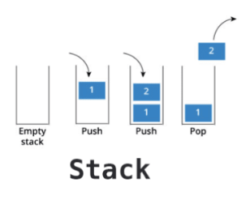
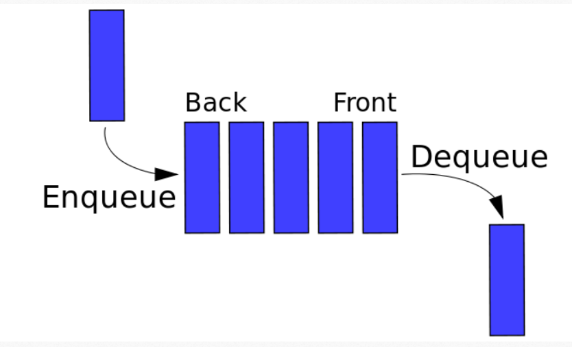

### Stack&Queue
- ### Stack (스택)
    - LIFO (Last In First Out)
        - 나중에 넣은 데이터가 먼저 반환되도록 설계한 메모리 구조
    - Push - 데이터 입력
    - Pop - 데이터 출력

    - python 
        - 리스트를 사용하여 스택 구조로 데이터 처리
        - Push → append()
        - Pop → pop()
        
- ### Queue (큐)
    - FIFO (First Input First Out)
        - 먼저 들어온 데이터가 먼저 반환되도록 설계한 메모리 구조
    - Push - Enqueue - 데이터 입력
    - Get - Dequeue - 데이터 출력

    - python
        - 리스트를 사용하여 큐 구조로 데이터 처리
        - Push → append()
        - Get → pop(0)
