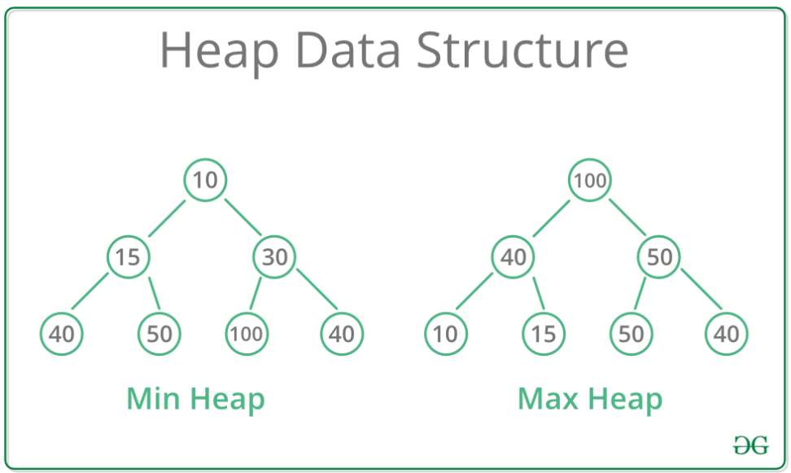

### 힙(Heap)
- ### 최댓값과 최솟값을 빠르게 찾기 위한 자료구조

    - 완전 이진 트리
        - 각 노드의 값이 자식 노드의 값 보다 작거나 큰 트리
        - **최대 힙(Max Heap)**
            - 각 노드의 값이 자식 노드의 값보다 크거나 같음
        - **최소 힙(Min Heap)**
            - 각 노드의 값이 자식 노드의 값보다 작거나 같음
    - 노드의 값의 대소 관계는 **부모-자식 노드 사이 에만** 성립
        - 현제 노드 사이에는 상관 없음
    - 자식 노드의 개수는 힙의 종류에 따라 다름
    - 시간복잡도
        - **O(log n)**
    

### 파이썬 힙 자료구조
- **heapq 모듈**을 통하여, 일반적인 리스트를 **최소 힙** 처럼 다룰 수 있게 해줌

- ### 모듈 임포트


```python
import heapq
```

- ### 힙 생성 & 원소 추가
    - 리스트를 최소 힙 처럼 다룰 수 있게 해준다.
    - **heap = 빈 리스트를 생성 → heapq.heappush(heap, 추가할 원소)** 를 통하여 원소 추가


```python
# 빈 리스트 생성
heap = []

heapq.heappush(heap, 50)
heapq.heappush(heap, 10)
heapq.heappush(heap, 20)

print(heap)
```

    [10, 50, 20]
    

- ### 기존 리스트를 힙 자료형으로 변환
    - **heapq.heapify(기존 리스트) 를 통하여 변환**


```python
heap2 = [50,10,20]

heapq.heapify(heap2)

print(heap2)
```

    [10, 50, 20]
    

- ### 힙에서 원소 삭제
    - **heapq.heappop(heap) 를 통하여 가장 작은 원소를 제거**
        - 최소 힙 이므로 트리의 루트가 제거된다.


```python
result = heapq.heappop(heap)

print("pop 된 원소 : ", result)
print("남은 힙 : ", heap)
```

    pop 된 원소 :  10
    남은 힙 :  [20, 50]
    

- ### 최대 힙 구현하기
    - 파이썬의 heapq 모듈은 최소 힙으로 구현
    - 최대 힙 구현을 위해서 방법이 필요
        - **- 부호를 붙여 줄 시 최솟값 정렬 → 최댓값 정렬 전환**
        - 힙에 원소 추가 시 (- 원소, 원소) 의 튜플 형태로 넣어준다.
        - 튜플의 첫 번째 원소를 우선 순위로 힙을 구성한다.


```python
heap_items = [1,3,5,7,9]

max_heap = []
for item in heap_items:
    heapq.heappush(max_heap, (-item, item))
    
print(max_heap)
```

    [(-9, 9), (-7, 7), (-3, 3), (-1, 1), (-5, 5)]
    
