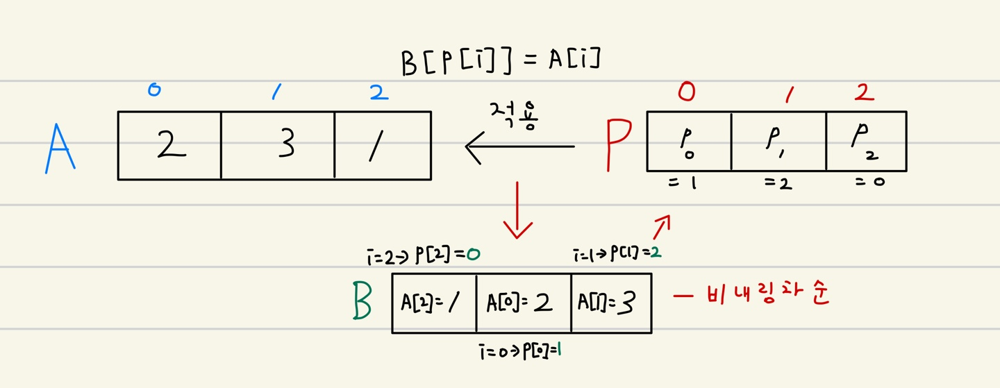

### 1015, 수열 정렬

**문제**
- P[0], P[1], ...., P[N-1]은 0부터 N-1까지(포함)의 수를 한 번씩 포함하고 있는 수열이다. 수열 P를 길이가 N인 배열 A에 적용하면 길이가 N인 배열 B가 된다. 적용하는 방법은 B[P[i]] = A[i]이다.

- 배열 A가 주어졌을 때, 수열 P를 적용한 결과가 비내림차순이 되는 수열을 찾는 프로그램을 작성하시오. 비내림차순이란, 각각의 원소가 바로 앞에 있는 원소보다 크거나 같을 경우를 말한다. 만약 그러한 수열이 여러개라면 사전순으로 앞서는 것을 출력한다.

**입력**
- 첫째 줄에 배열 A의 크기 N이 주어진다. 둘째 줄에는 배열 A의 원소가 0번부터 차례대로 주어진다. N은 50보다 작거나 같은 자연수이고, 배열의 원소는 1,000보다 작거나 같은 자연수이다.

**출력**
- 첫째 줄에 비내림차순으로 만드는 수열 P를 출력한다.


**아이디어**
- i = 0 → P[0] = 1 → B[1] = A[0] = 2
- i = 1 → P[1] = 2 → B[2] = A[1] = 3
- i = 2 → P[2] = 0 → B[0] = A[2] = 1
- 풀이 방법
    - A 를 오름차순으로 정렬 하여 B 수열 찾음
    - i = B 의 각 값들에 해당하는 A 수열의 인덱스
        - P[i] = B 수열에 해당하는 인덱스


```python
N = int(input())
A = list(map(int,input().split()))

A_dict = dict()

for i in range(len(A)):
    A_dict[i] = A[i] # key : index, value : 값

B = sorted(A_dict.items(),reverse = False, key = lambda x: x[1]) # value 기준으로 오름차순 정렬

for i in range(len(B)):
    B[i] = [B[i][0],i] # 해당 인덱스 
    
B.sort()

for b in B:
    print(b[1], end=" ")
```

    3
    2 3 1
    (2, 1)
    (0, 2)
    (1, 3)
    1 2 0 

### 15922, 아우으 우아으이야!!

**문제**
- 수직선 위에 선분을 여러 개 그릴 거 야

- 선분을 겹치게 그리는 것도 가능하다

- 선분을 모두 그렸을 때, 수직선 위에 그려진 선분 길이의 총합은 얼마

**입력**
- 첫째 줄에 수직선 위에 그릴 선분의 개수 N이 주어진다. (1 ≤ N ≤ 100,000)

- 둘째 줄 부터 N개의 줄에 좌표를 나타내는 정수쌍 (x, y)가 주어진다.

- 이는 [x, y] 구간 (x와 y를 포함하는 구간)에 선분을 그린다는 의미이다. 

- 좌표는 x가 증가하는 순으로, x가 같다면 y가 증가하는 순으로 주어진다. (-1,000,000,000 ≤ x < y ≤ 1,000,000,000)

**출력**
- N개의 선분을 모두 그렸을 때, 수직선 위에 그어진 선분 길이의 총합을 출력한다!!!

**아이디어**
- 스와핑 알고리즘 활용
- [x,y] 구간 (x 와 y를 포함하는 구간)에 선분을 그린다
- 좌표는 x가 증가하는 순으로, x 가 같다면 y가 증가하는 순으로 주어진다.
    - 이전 x 와 y 사이에 현재 x 가 포함 된다면 구간을 합쳐야 한다.
    - 첫 입력 받은 선분 초기화 [시작, 끝]
    - N-1번 반복
        - 입력 [x, y]
        - 입력받은 x 가 현재 선분에 포함 될 시
            - 선분의 끝을 y 로 변경하여 연장
        - 포함 안 될 시
            - 결과값에 현재 선분의 길이를 더함
            - 현재 선분을 입력받은 [x, y] 로 변결


```python
import sys
N = int(input())

result = 0

x, y = map(int,input().split())
line = [x,y]

for _ in range(N-1):
    x, y = map(int,input().split())
    
    if line[0] <= x <= line[1]: # 선분 집합에 입력받은 부분이 겹칠 시
        if line[1] <= y:
            line[1] = y
    else: # 선분 집합에 입력받은 부분이 안 겹칠 시
        result += line[1] - line[0]
        line = [x,y]
        
result += line[1] - line[0]
        
print(result)
```

    5
    -5 -2
    -3 0
    2 5
    6 10
    8 12
    14
    

### 10814, 나이순 정렬

**문제**
- 온라인 저지에 가입한 사람들의 나이와 이름이 가입한 순서대로 주어진다. 이때, 회원들을 나이가 증가하는 순으로, 나이가 같으면 먼저 가입한 사람이 앞에 오는 순서로 정렬하는 프로그램을 작성하시오.

**입력**
- 첫째 줄에 온라인 저지 회원의 수 N이 주어진다. (1 ≤ N ≤ 100,000)

- 둘째 줄부터 N개의 줄에는 각 회원의 나이와 이름이 공백으로 구분되어 주어진다. 나이는 1보다 크거나 같으며, 200보다 작거나 같은 정수이고, 이름은 알파벳 대소문자로 이루어져 있고, 길이가 100보다 작거나 같은 문자열이다. 입력은 가입한 순서로 주어진다.

**출력**
- 첫째 줄부터 총 N개의 줄에 걸쳐 온라인 저지 회원을 나이 순, 나이가 같으면 가입한 순으로 한 줄에 한 명씩 나이와 이름을 공백으로 구분해 출력한다.

**아이디어**
- 나이를 key, 이름 배열을 value 로 갖는 딕셔너리 생성


```python
N = int(input())

members = dict()

for _ in range(N):
    age, name = input().split()
    age = int(age)
    
    if age not in members.keys():
        members[age] = [name]
    else:
        members[age].append(name)
    
for i in sorted(members.keys()):
    for member in members[i]:
        print(i, member)
```

    3
    21 f
    21 g
    20 a
    20 a
    21 f
    21 g
    

### 2437, 저울

**문제**
- 하나의 양팔 저울을 이용하여 물건의 무게를 측정하려고 한다. 이 저울의 양 팔의 끝에는 물건이나 추를 올려놓는 접시가 달려 있고, 양팔의 길이는 같다. 또한, 저울의 한쪽에는 저울추들만 놓을 수 있고, 다른 쪽에는 무게를 측정하려는 물건만 올려놓을 수 있다.

- 무게가 양의 정수인 N개의 저울추가 주어질 때, 이 추들을 사용하여 측정할 수 없는 양의 정수 무게 중 최솟값을 구하는 프로그램을 작성하시오.

- 예를 들어, 무게가 각각 3, 1, 6, 2, 7, 30, 1인 7개의 저울추가 주어졌을 때, 이 추들로 측정할 수 없는 양의 정수 무게 중 최솟값은 21이다. 

**입력**
- 첫 째 줄에는 저울추의 개수를 나타내는 양의 정수 N이 주어진다. N은 1 이상 1,000 이하이다. 둘째 줄에는 저울추의 무게를 나타내는 N개의 양의 정수가 빈칸을 사이에 두고 주어진다. 각 추의 무게는 1이상 1,000,000 이하이다.

**출력**
- 첫째 줄에 주어진 추들로 측정할 수 없는 양의 정수 무게 중 최솟값을 출력한다.

**아이디어**
- 입력 받은 무게들을 정렬한다.
- 측정 가능한 수 + 1 을 한 것이 결과?
- 앞에서 부터 차례대로 더함
    - 현재 숫자 보다 작으면(크거나 같지 않을 시) 


```python
N = int(input())

chus = sorted(list(map(int,input().split())))

temp = 1

for chu in chus:
    if temp < chu:
        break
    temp += chu
    
print(temp)
```

    7
    3 1 6 2 7 30 1
    21
    

### 11656, 접미사 배열

**문제**
- 접미사 배열은 문자열 S의 모든 접미사를 사전순으로 정렬해 놓은 배열이다.

- baekjoon의 접미사는 baekjoon, aekjoon, ekjoon, kjoon, joon, oon, on, n 으로 총 8가지가 있고, 이를 사전순으로 정렬하면, aekjoon, baekjoon, ekjoon, joon, kjoon, n, on, oon이 된다.

- 문자열 S가 주어졌을 때, 모든 접미사를 사전순으로 정렬한 다음 출력하는 프로그램을 작성하시오.

**입력**
- 첫째 줄에 문자열 S가 주어진다. S는 알파벳 소문자로만 이루어져 있고, 길이는 1,000보다 작거나 같다.

**출력**
- 첫째 줄부터 S의 접미사를 사전순으로 한 줄에 하나씩 출력한다.

**아이디어**
- 그냥 앞에서 부터 하나씩 제거하며 리스트에 추가
- 사전 순으로 정렬 하여 출력한다.


```python
S = input()

Ss = list()

for i in range(len(S)):
    Ss.append(S[i:])
    
for s in sorted(Ss):
    print(s)
```

    baekjoon
    aekjoon
    baekjoon
    ekjoon
    joon
    kjoon
    n
    on
    oon
    

### 1302, 베스트셀러

**문제**
- 김형택은 탑문고의 직원이다. 김형택은 계산대에서 계산을 하는 직원이다. 김형택은 그날 근무가 끝난 후에, 오늘 판매한 책의 제목을 보면서 가장 많이 팔린 책의 제목을 칠판에 써놓는 일도 같이 하고 있다.

- 오늘 하루 동안 팔린 책의 제목이 입력으로 들어왔을 때, 가장 많이 팔린 책의 제목을 출력하는 프로그램을 작성하시오.

**입력**
- 첫째 줄에 오늘 하루 동안 팔린 책의 개수 N이 주어진다. 이 값은 1,000보다 작거나 같은 자연수이다. 둘째부터 N개의 줄에 책의 제목이 입력으로 들어온다. 책의 제목의 길이는 50보다 작거나 같고, 알파벳 소문자로만 이루어져 있다.

**출력**
- 첫째 줄에 가장 많이 팔린 책의 제목을 출력한다. 만약 가장 많이 팔린 책이 여러 개일 경우에는 사전 순으로 가장 앞서는 제목을 출력한다.

**아이디어**
- key : 책 이름, value : 책 판매량
- dict()에 책 판매 데이터 추가
- value값이 max 인 책들만 뽑아 낸다.


```python
N = int(input())

books = dict()

for _ in range(N):
    book = input()
    
    if book not in books.keys():
        books[book] = 1
    else:
        books[book] += 1
        
        
max_sale = max(books.values())

result_list = list()

for i in range(len(books)):
    book = list(books.keys())[i]
    sales = books[book] # 해당 책의 판매 량
    if sales == max_sale:
        result_list.append(book)
        
result_list.sort()

print(result_list[0])
```

    5
    b
    b
    a
    a
    c
    ['b', 'a']
    a
    
