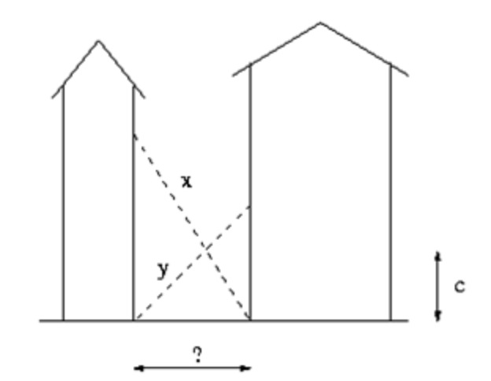

### 2022, 사다리

**문제**
- 아래의 그림과 같이 높은 빌딩 사이를 따라 좁은 길이 나있다. 두 개의 사다리가 있는데 길이가 x인 사다리는 오른쪽 빌딩의 아래를 받침대로 하여 왼쪽 빌딩에 기대져 있고 길이가 y인 사다리는 왼쪽 빌딩의 아래를 받침대로 하여 오른쪽 빌딩에 기대져 있다. 그리고 두 사다리는 땅에서부터 정확하게 c인 지점에서 서로 교차한다. 그렇다면 두 빌딩은 얼마나 떨어져 있는 걸까?



**입력**
- 첫째 줄에 차례대로 x, y, c에 해당하는 양의 실수 세 개가 입력된다. 수는 소수점 여섯째 자리까지 주어질 수 있으며, 3,000,000,000보다 작거나 같다.

**출력**
- 두 빌딩사이에 너비가 되는 수치를 출력한다. 절대/상대 오차는 10<sup>-3</sup> 까지 허용한다.

**아이디어**
- w = x1 + y1
- x1 : c = w : hx
    - hx = (x<sup>2</sup> - w<sup>2</sup>)<sup>1/2</sup> 
- y1 : c = w : hy
    - hy = (y<sup>2</sup> - w<sup>2</sup>)<sup>1/2</sup>
    
- cw = x1 X hx = y1 X hy
- w = x1 + y1 = cw/hx + cw/hy
- 1 = c X ((hx + hy) / hx X hy)
- c = hx X hy / (hx+hy)
    
- 위 비례식을 만족하는 w 를 이분 탐색으로 찾기
    - 0 ~ min(x,y) 
        - w < min(x,y)
    - mid = w
    

- mid 를 몫이 아닌 소수점으로 구해야 함
- left, right 값 변경을 mid 값 그대로 해줌


```python
x,y,c = map(float, input().split())

left = 0
right = min(x,y)
res = 0

def find_c(x,y,w):
    hx = (x**2-w**2)**0.5
    hy = (y**2-w**2)**0.5
    c = (hx*hy)/(hx+hy)
    return c
    

while right-left > 0.000001:
    mid = (left + right) / 2
    
    if find_c(x,y,mid) >= c:
        res = mid
        left = mid
    else:
        right = mid
        
print(res)
```

    10 10 1
    9.797958731651306


### 13702, 이상한 술집

**문제**
- 프로그래밍 대회 전날, 은상과 친구들은 이상한 술집에 모였다. 이 술집에서 막걸리를 시키면 주전자의 용량은 똑같았으나 안에 들어 있는 막걸리 용량은 랜덤이다.  즉 한 번 주문에 막걸리 용량이 802ml 이기도 1002ml가 나오기도 한다.  은상은 막걸리 N 주전자를 주문하고, 자신을 포함한 친구들 K명에게 막걸리를 똑같은 양으로 나눠주려고 한다.  그런데 은상과 친구들은 다른 주전자의 막걸리가 섞이는 것이 싫어서, 분배 후 주전자에 막걸리가 조금 남아 있다면 그냥 막걸리를 버리기로 한다.  (즉, 한 번 주문한 막걸리에 남은 것을 모아서 친구들에게 다시 주는 경우는 없다.  예를 들어 5명이 3 주전자를 주문하여 1002, 802, 705 ml의 막걸리가 각 주전자에 담겨져 나왔고, 이것을 401ml로 동등하게 나눴을 경우 각각 주전자에서 200ml, 0m, 304ml 만큼은 버린다.) 이럴 때 K명에게 최대한의 많은 양의 막걸리를 분배할 수 있는 용량 ml는 무엇인지 출력해주세요.

**입력**
- 첫째 줄에는 은상이가 주문한 막걸리 주전자의 개수 N, 그리고 은상이를 포함한 친구들의 수 K가 주어진다. 둘째 줄부터 N개의 줄에 차례로 주전자의 용량이 주어진다. N은 10000이하의 정수이고, K는 1,000,000이하의 정수이다. 막걸리의 용량은 231 -1 보다 작거나 같은 자연수 또는 0이다. 단, 항상 N ≤ K 이다. 즉, 주전자의 개수가 사람 수보다 많을 수는 없다.

**출력**
- 첫째 줄에 K명에게 나눠줄 수 있는 최대의 막걸리 용량 ml 를 출력한다.

**아이디어**
- result 값을 0 이 아닌 max(막걸리 용량 들) 로 해줘서 최대 값을 찾게 해줌
- 끝값을 min 이 아닌 max 로 해 줘야함


```python
N, K = map(int, input().split())
mls = list()

for _ in range(N):
    mls.append(int(input()))

start  = 0
end = max(mls)
res = max(mls)

def check(mls, K, mid):
    ans = 0
    for ml in mls:
        ans += (ml//mid)
    if ans >= K:
        return True
    else :
        return False


while start <= end:
    mid = (start + end) // 2
   
    if check(mls, K, mid):
        res = mid
        start = mid + 1
    else :
        end = mid - 1

print(res)
```

    4 11
    427
    541
    774
    822
    205


### 10815, 숫자카드

**문제**
- 숫자 카드는 정수 하나가 적혀져 있는 카드이다. 상근이는 숫자 카드 N개를 가지고 있다. 정수 M개가 주어졌을 때, 이 수가 적혀있는 숫자 카드를 상근이가 가지고 있는지 아닌지를 구하는 프로그램을 작성하시오.

**입력**
- 첫째 줄에 상근이가 가지고 있는 숫자 카드의 개수 N(1 ≤ N ≤ 500,000)이 주어진다. 둘째 줄에는 숫자 카드에 적혀있는 정수가 주어진다. 숫자 카드에 적혀있는 수는 -10,000,000보다 크거나 같고, 10,000,000보다 작거나 같다. 두 숫자 카드에 같은 수가 적혀있는 경우는 없다.

- 셋째 줄에는 M(1 ≤ M ≤ 500,000)이 주어진다. 넷째 줄에는 상근이가 가지고 있는 숫자 카드인지 아닌지를 구해야 할 M개의 정수가 주어지며, 이 수는 공백으로 구분되어져 있다. 이 수도 -10,000,000보다 크거나 같고, 10,000,000보다 작거나 같다

**출력**
- 첫째 줄에 입력으로 주어진 M개의 수에 대해서, 각 수가 적힌 숫자 카드를 상근이가 가지고 있으면 1을, 아니면 0을 공백으로 구분해 출력한다.

**아이디어**
- 둘째줄 입력 수 를 이분탐색으로 네번째 줄 입력 수 에서 찾는다.


```python
N = int(input())
nums = list(map(int, input().split()))

M = int(input())
input_nums = list(map(int, input().split()))

nums.sort()

def binary_search(target, nums):
    left = 0
    right = len(nums)-1
    
    while left <= right:
        mid = (left + right)//2
        
        if nums[mid] == target:
            return True
        elif nums[mid] < target:
            left = mid + 1
        else :
            right = mid - 1
    
    return False

for i in range(M):
    n = input_nums[i]
    
    if binary_search(n, nums):
        print("1", end = " ")
    else :
        print("0", end = " ")
```

    5
    6 3 2 10 -10
    8
    10 9 -5 2 3 4 5 -10
    1 0 0 1 1 0 0 1 

### 2512, 예산

**문제**
- 국가의 역할 중 하나는 여러 지방의 예산요청을 심사하여 국가의 예산을 분배하는 것이다. 국가예산의 총액은 미리 정해져 있어서 모든 예산요청을 배정해 주기는 어려울 수도 있다. 그래서 정해진 총액 이하에서 가능한 한 최대의 총 예산을 다음과 같은 방법으로 배정한다.

    1. 모든 요청이 배정될 수 있는 경우에는 요청한 금액을 그대로 배정한다.
    2. 모든 요청이 배정될 수 없는 경우에는 특정한 정수 상한액을 계산하여 그 이상인 예산요청에는 모두 상한액을 배정한다. 상한액 이하의 예산요청에 대해서는 요청한 금액을 그대로 배정한다. 

- 예를 들어, 전체 국가예산이 485이고 4개 지방의 예산요청이 각각 120, 110, 140, 150이라고 하자. 이 경우, 상한액을 127로 잡으면, 위의 요청들에 대해서 각각 120, 110, 127, 127을 배정하고 그 합이 484로 가능한 최대가 된다. 

- 여러 지방의 예산요청과 국가예산의 총액이 주어졌을 때, 위의 조건을 모두 만족하도록 예산을 배정하는 프로그램을 작성하시오.

**입력**
- 첫째 줄에는 지방의 수를 의미하는 정수 N이 주어진다. N은 3 이상 10,000 이하이다. 다음 줄에는 각 지방의 예산요청을 표현하는 N개의 정수가 빈칸을 사이에 두고 주어진다. 이 값들은 모두 1 이상 100,000 이하이다. 그 다음 줄에는 총 예산을 나타내는 정수 M이 주어진다. M은 N 이상 1,000,000,000 이하이다. 

**출력**
- 첫째 줄에는 배정된 예산들 중 최댓값인 정수를 출력한다. 


```python
N = int(input())
nums = list(map(int, input().split()))
M = int(input())

start = 0
end = max(nums)
res = max(nums)

def check(nums, M, mid):
    chk = 0
    for n in nums:
        if n <= mid:
            chk += n
        else :
            chk += mid
    
    if chk > M :
        return False
    else :
        return True
    
while start <= end:
    mid = (start + end) // 2
    
    if check(nums, M, mid):
        res = mid
        start = mid + 1
    else:
        end = mid - 1
        
print(res)
```

    5
    70 80 30 40 100
    450
    100

